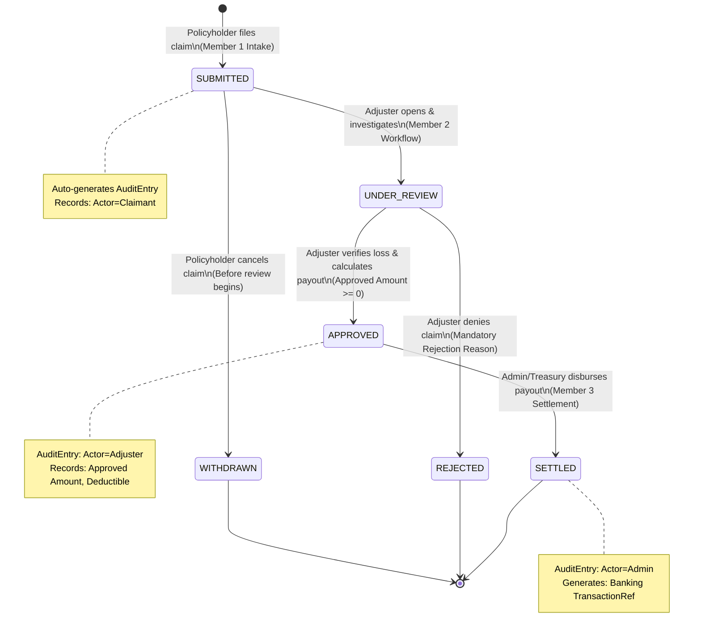

# Insurance Claim System — System Architecture & Workflow Specification

> **Course:** RUET CSE 3206 (Software Engineering Sessional)  
> **Lab:** #Lab 2: Software Process Models, Requirement Analysis & MVP Development  
> **Team:** Group 21 (`Group#01 from Section B (1st 30)`)  
> **Process Model:** **Waterfall Model**  
> **Target Audience:** All 3 Team Members (Design Blueprint & Developer Guide)

---

## 1. System Architecture Overview

The **Insurance Claim System (ICS)** follows a clean **Layered Client-Server Architecture** designed for high modularity, deterministic state transitions, and strict audit compliance.

```text
┌────────────────────────────────────────────────────────────────────────────────────────┐
│                               PRESENTATION LAYER (React 19 + Vite)                    │
│  ┌─────────────────────────┐ ┌─────────────────────────┐ ┌──────────────────────────┐  │
│  │   Policyholder Portal   │ │   Adjuster Workspace    │ │   Executive Dashboard    │  │
│  │   (Member 1 UI)         │ │   (Member 2 UI)         │ │   (Member 3 UI)          │  │
│  └────────────┬────────────┘ └────────────┬────────────┘ └────────────┬─────────────┘  │
│               └─────────────────────┬─────┴───────────────────────────┘                │
│                                     ▼                                                  │
│                          Shared API Client & Types                                     │
└─────────────────────────────────────┬──────────────────────────────────────────────────┘
                                      │ HTTP / JSON REST
┌─────────────────────────────────────▼──────────────────────────────────────────────────┐
│                                APPLICATION LAYER (Express + TypeScript)                │
│  ┌──────────────────────────────────────────────────────────────────────────────────┐  │
│  │                              REST API ROUTING LAYER                              │  │
│  │    /api/auth       /api/policies       /api/claims       /api/analytics          │  │
│  └────────┬───────────────────┬───────────────────┬───────────────────┬─────────────┘  │
│           ▼                   ▼                   ▼                   ▼                │
│  ┌─────────────────┐ ┌─────────────────┐ ┌─────────────────┐ ┌──────────────────────┐  │
│  │ Policy & Intake │ │  Adjudication   │ │  Settlement &   │ │  Audit Logging       │  │
│  │ Service (Mem 1) │ │  Engine (Mem 2) │ │  Disburse(Mem 3)│ │  Engine (Mem 3)      │  │
│  └────────┬────────┘ └────────┬────────┘ └────────┬────────┘ └────────┬─────────────┘  │
└───────────┼───────────────────┼───────────────────┼───────────────────┼────────────────┘
            └───────────────────┴─────────┬─────────┴───────────────────┘
                                          ▼
┌────────────────────────────────────────────────────────────────────────────────────────┐
│                                DATA PERSISTENCE LAYER                                  │
│  ┌──────────────────────────────────────────────────────────────────────────────────┐  │
│  │                In-Memory Typed Repository & Seed Data Store                      │  │
│  │  • Users Store    • Policies Store    • Claims Store    • Immutable Audit Logs   │  │
│  └──────────────────────────────────────────────────────────────────────────────────┘  │
└────────────────────────────────────────────────────────────────────────────────────────┘
```

### Key Architectural Pillars:
1. **Separation of Concerns:** Frontend views never directly alter state without validating through backend domain services.
2. **Contract-First Engineering:** Data models and API endpoints are frozen upfront, allowing Members 1, 2, and 3 to code independently.
3. **Zero-Setup Portability:** The backend utilizes an in-memory JSON data store pre-populated with realistic seed data. No complex external database setup is needed to test or demonstrate the project.
4. **Future-Proof for Lab 3/4:** The service layers are organized to directly accept Design Patterns in upcoming milestones (State Pattern for claims, Strategy Pattern for deductible calculations, Observer Pattern for audit dispatching).

---

## 2. Unified Data Schema & TypeScript Models

Both backend (`src/backend/src/models/types.ts`) and frontend (`src/frontend/src/types/index.ts`) share this standardized schema.

```typescript
// ==========================================
// 1. USER & ROLE DOMAIN
// ==========================================
export type UserRole = 'POLICYHOLDER' | 'ADJUSTER' | 'ADMIN';

export interface User {
  id: string;              // e.g. "USR-001"
  name: string;            // e.g. "Alice Johnson"
  email: string;           // e.g. "alice@ruet.ac.bd"
  role: UserRole;
  phone: string;
  policyIds: string[];     // Active policies owned by this user
  createdAt: string;       // ISO Date string
}

// ==========================================
// 2. POLICY DOMAIN (Member 1)
// ==========================================
export type PolicyType = 'HEALTH' | 'AUTO' | 'HOME' | 'LIFE';

export type PolicyStatus = 'ACTIVE' | 'EXPIRED' | 'SUSPENDED';

export interface Policy {
  id: string;              // e.g. "POL-AUTO-101"
  policyNumber: string;    // e.g. "PN-2026-9812"
  type: PolicyType;
  title: string;           // e.g. "Comprehensive Vehicle Protection"
  description: string;
  coverageLimit: number;   // Maximum payable amount (e.g. 25000)
  deductible: number;      // Amount claimant pays out-of-pocket (e.g. 500)
  premiumAmount: number;   // Annual/Monthly premium (e.g. 1200)
  startDate: string;       // ISO Date string
  endDate: string;         // ISO Date string
  status: PolicyStatus;
}

// ==========================================
// 3. CLAIM DOMAIN (Core Workflow)
// ==========================================
export type ClaimStatus = 
  | 'SUBMITTED'      // Newly filed by claimant, awaiting review
  | 'UNDER_REVIEW'   // Claim adjuster has opened & investigated claim
  | 'APPROVED'       // Claim adjuster verified liability and set payout
  | 'REJECTED'       // Claim adjuster rejected claim with justification
  | 'SETTLED'        // Finance/Admin disbursed the payment to claimant
  | 'WITHDRAWN';     // Claimant cancelled before review began

export interface Claim {
  id: string;                 // Unique identifier, e.g. "CLM-1001"
  claimNumber: string;        // Human-friendly reference, e.g. "CLAIM-2026-001"
  policyId: string;           // Associated Policy ID
  policyholderId: string;     // Claimant User ID
  policyholderName: string;   // Cached claimant display name
  policyType: PolicyType;     // AUTO, HEALTH, HOME, LIFE
  
  // Incident Information (Member 1)
  incidentDate: string;       // Date of loss (cannot be future)
  submissionDate: string;     // ISO timestamp of filing
  claimedAmount: number;      // Amount requested by claimant
  incidentLocation: string;   // Physical address / city
  description: string;        // Detailed explanation of loss
  evidenceUrls: string[];     // URLs or filenames of uploaded proofs
  
  // Adjudication Information (Member 2)
  status: ClaimStatus;
  assignedAdjusterId?: string;// ID of assigned claims examiner
  assessedLoss?: number;      // Verified loss after adjuster assessment
  deductibleApplied?: number; // Deductible deducted from settlement
  approvedAmount?: number;    // Final approved payout amount
  adjusterNotes?: string;     // Internal evaluation remarks
  rejectionReason?: string;   // Required if status == 'REJECTED'
  
  // Settlement Information (Member 3)
  settlementDate?: string;    // Timestamp when payout was disbursed
  transactionRef?: string;    // Banking mock reference, e.g. "TXN-8742918"
  
  createdAt: string;
  updatedAt: string;
}

// ==========================================
// 4. ADJUDICATION DECISION PAYLOAD (Member 2)
// ==========================================
export interface AdjudicationPayload {
  decision: 'APPROVE' | 'REJECT';
  assessedLoss?: number;
  approvedAmount?: number;
  deductibleApplied?: number;
  adjusterNotes: string;
  rejectionReason?: string;
  rejectionCategory?: 'POLICY_EXCLUSION' | 'INSUFFICIENT_PROOF' | 'FRAUD_SUSPICION' | 'EXPIRED_POLICY';
}

// ==========================================
// 5. AUDIT & SETTLEMENT DOMAIN (Member 3)
// ==========================================
export interface AuditEntry {
  logId: string;              // e.g. "LOG-5001"
  claimId: string;            // Reference to Claim
  timestamp: string;          // ISO Timestamp
  actorId: string;            // User ID who performed the action
  actorName: string;          // User display name
  actorRole: UserRole;        // POLICYHOLDER, ADJUSTER, ADMIN
  action: string;             // e.g. "SUBMIT_CLAIM", "STATUS_CHANGE", "DISBURSE_PAYOUT"
  previousState: ClaimStatus | 'NONE';
  newState: ClaimStatus;
  remarks: string;            // Explanation or decision notes
}

export interface SettlementReceipt {
  settlementId: string;       // e.g. "SETTLE-901"
  claimId: string;
  transactionRef: string;     // e.g. "TXN-2026-58319"
  claimantName: string;
  policyNumber: string;
  amountDisbursed: number;
  disbursementTimestamp: string;
  paymentMethod: 'DIRECT_DEPOSIT' | 'CHECK' | 'WIRE';
}

export interface AnalyticsSummary {
  totalClaims: number;
  pendingReviewCount: number;
  approvedCount: number;
  rejectedCount: number;
  settledCount: number;
  totalClaimedValue: number;
  totalDisbursedValue: number;
  averageTurnaroundHours: number;
  claimsByCategory: Record<PolicyType, number>;
}
```

---

## 3. Complete REST API Contract

The following endpoints represent the **frozen API contract**. All members develop their controllers and UI views strictly conforming to these specifications.

### 3.1 Authentication & User Endpoints (Shared)
- `GET /api/auth/users`
  - **Purpose:** Return all seed users for easy multi-role switching.
  - **Response 200:** `User[]`
- `POST /api/auth/login`
  - **Body:** `{ email: string }`
  - **Response 200:** `{ user: User, token: string }`

---

### 3.2 Policy Management Endpoints (Member 1)
- `GET /api/policies`
  - **Purpose:** Retrieve all active insurance policies in the catalog.
  - **Response 200:** `Policy[]`
- `GET /api/policies/:id`
  - **Purpose:** Retrieve details of a specific policy by ID.
  - **Response 200:** `Policy`
- `GET /api/policies/user/:userId`
  - **Purpose:** Retrieve all policies owned by a specific policyholder.
  - **Response 200:** `Policy[]`

---

### 3.3 Claim Intake Endpoints (Member 1)
- `POST /api/claims`
  - **Purpose:** Policyholder submits a new insurance claim.
  - **Body:**
    ```json
    {
      "policyId": "POL-AUTO-101",
      "policyholderId": "USR-001",
      "incidentDate": "2026-09-01",
      "claimedAmount": 2500,
      "incidentLocation": "Station Road, Rajshahi",
      "description": "Rear bumper damaged in minor parking collision.",
      "evidenceUrls": ["https://example.com/receipt.jpg"]
    }
    ```
  - **Validation Rules:**
    - `incidentDate` $\le$ Today's Date.
    - `claimedAmount` $> 0$ and $\le$ `policy.coverageLimit`.
    - Policy must belong to `policyholderId` and have `status: 'ACTIVE'`.
  - **Response 201:** `Claim` (initial status: `'SUBMITTED'`)
  - **Response 422:** `{ error: "Validation Error", details: string }`
- `GET /api/claims/my-claims?userId=USR-001`
  - **Purpose:** Return all claims submitted by the logged-in policyholder.
  - **Response 200:** `Claim[]`
- `DELETE /api/claims/:id`
  - **Purpose:** Policyholder cancels/withdraws a claim.
  - **Rule:** Can only be withdrawn if `status === 'SUBMITTED'`.
  - **Response 200:** `{ message: "Claim withdrawn successfully" }`

---

### 3.4 Claims Adjudication Endpoints (Member 2)
- `GET /api/adjuster/claims`
  - **Purpose:** Adjuster claims work queue.
  - **Query Params:** `?status=SUBMITTED&category=AUTO`
  - **Response 200:** `Claim[]`
- `PATCH /api/claims/:id/assign`
  - **Purpose:** Adjuster assigns themselves to a claim and moves status to `UNDER_REVIEW`.
  - **Body:** `{ adjusterId: "USR-003", adjusterName: "Charlie Adjuster" }`
  - **Response 200:** `Claim`
- `POST /api/claims/:id/adjudicate`
  - **Purpose:** Adjuster approves or rejects a claim.
  - **Body (Approval):**
    ```json
    {
      "decision": "APPROVE",
      "assessedLoss": 2500,
      "approvedAmount": 2000,
      "deductibleApplied": 500,
      "adjusterNotes": "Vehicle damage inspected. Damage matches invoice."
    }
    ```
  - **Body (Rejection):**
    ```json
    {
      "decision": "REJECT",
      "rejectionCategory": "POLICY_EXCLUSION",
      "rejectionReason": "Damage caused by driver operating without valid license.",
      "adjusterNotes": "Claim denies coverage under Section 4.2 of Policy terms."
    }
    ```
  - **Validation Rules:**
    - Claim must currently be in `UNDER_REVIEW` or `SUBMITTED`.
    - If `APPROVE`: `approvedAmount` $\le$ `policy.coverageLimit` and `approvedAmount` $\le$ `assessedLoss`.
    - If `REJECT`: `rejectionReason` must not be empty.
  - **Response 200:** `Claim`

---

### 3.5 Governance, Settlement & Analytics Endpoints (Member 3)
- `GET /api/claims/:id/audit-trail`
  - **Purpose:** Retrieve complete chronological audit history for a claim.
  - **Response 200:** `AuditEntry[]`
- `POST /api/claims/:id/disburse`
  - **Purpose:** Treasury/Admin disburses payment for an `APPROVED` claim.
  - **Body:** `{ paymentMethod: "DIRECT_DEPOSIT" }`
  - **Validation Rules:** Claim must be in `APPROVED` status.
  - **Response 200:** `SettlementReceipt` (Claim moves to `SETTLED`)
- `GET /api/analytics/overview`
  - **Purpose:** Return executive metrics and financial summaries.
  - **Response 200:** `AnalyticsSummary`
- `POST /api/system/reset-seed`
  - **Purpose:** Reset data store back to baseline seed data for viva demonstrations.
  - **Response 200:** `{ message: "System state reset to seed data" }`

---

## 4. End-to-End Business Workflow (The Claim Lifecycle)



### Complete Walkthrough of a Claim:
1. **Intake (Alice - Policyholder):**
   - Alice logs in $\rightarrow$ views her Auto Insurance Policy (Coverage: \$25,000, Deductible: \$500).
   - Alice submits a \$2,500 repair claim with photos from Station Road, Rajshahi.
   - Subsystem 1 validates the payload $\rightarrow$ creates `CLM-1001` with status `SUBMITTED`.
   - Subsystem 3 automatically appends an audit log: `Action: CLAIM_SUBMITTED by Alice`.
2. **Investigation (Charlie - Adjuster):**
   - Charlie logs in $\rightarrow$ sees `CLM-1001` at the top of his queue.
   - Charlie clicks "Inspect" $\rightarrow$ moves status to `UNDER_REVIEW`.
   - Subsystem 3 logs: `Action: STATUS_CHANGE to UNDER_REVIEW by Charlie`.
3. **Adjudication (Charlie - Adjuster):**
   - Charlie verifies the \$2,500 repair bill $\rightarrow$ enters assessed loss = \$2,500.
   - System applies \$500 policy deductible $\rightarrow$ calculates approved settlement = \$2,000.
   - Charlie confirms approval $\rightarrow$ status becomes `APPROVED`.
   - Subsystem 3 logs: `Action: CLAIM_APPROVED ($2,000) by Charlie`.
4. **Disbursement (Dana - Administrator):**
   - Dana logs into Executive Dashboard $\rightarrow$ reviews settlement queue.
   - Dana clicks "Disburse Settlement" $\rightarrow$ generates reference `TXN-2026-98124`.
   - Status updates to `SETTLED`.
   - Subsystem 3 logs: `Action: SETTLEMENT_DISBURSED by Dana`.
5. **Real-Time Visibility:**
   - Alice checks her portal $\rightarrow$ sees status `SETTLED`, payout of \$2,000, and full timeline.

---

## 5. Frontend UI Structure & Component Mapping

```text
src/frontend/src/
├── App.tsx                    # Main App Container & Role Navigation Header
├── index.css                  # Global Tailwind / Modern CSS Styling
├── main.tsx                   # React 19 Entry Root
│
├── types/
│   └── index.ts               # Shared Data Models & Interfaces
│
├── services/
│   └── api.ts                 # Unified Axios/Fetch API Client
│
└── components/
    ├── shared/                # Common Reusable UI Elements
    │   ├── Navbar.tsx         # Header with User Role Switcher & RUET Logo
    │   ├── StatusBadge.tsx    # Color-coded status badge (Green=Approved, etc.)
    │   ├── StatCard.tsx       # Metric summary card with icons
    │   └── AlertBanner.tsx    # Error & success message toasts
    │
    ├── claimant/              # MEMBER 1 COMPONENTS
    │   ├── ClaimantPortal.tsx # Main Policyholder view
    │   ├── PolicyCard.tsx     # Active policy display card
    │   ├── ClaimWizard.tsx    # Multi-step claim submission form
    │   └── MyClaimsList.tsx   # History of submitted claims with tracking
    │
    ├── adjuster/              # MEMBER 2 COMPONENTS
    │   ├── AdjusterPortal.tsx # Claims inspection queue with search/filter
    │   ├── ClaimDetailModal.tsx # Side-by-side evidence & statement viewer
    │   ├── LossCalculator.tsx # Dynamic deductible & payout calculator
    │   └── AdjudicationModal.tsx # Formal Approve / Reject dialog
    │
    └── admin/                 # MEMBER 3 COMPONENTS
        ├── AdminPortal.tsx    # Executive oversight dashboard
        ├── MetricSummary.tsx  # KPI charts and financial ratios
        ├── SettlementTable.tsx# Table of approved claims for disbursement
        └── AuditTimeline.tsx  # Chronological visual audit trail inspector
```

---

## 6. Backend Codebase Structure

```text
src/backend/src/
├── server.ts                  # Express application setup & listener
├── config.ts                  # Port, environment, CORS configuration
│
├── models/
│   └── types.ts               # Shared TypeScript schemas
│
├── data/
│   └── seedData.ts            # Realistic pre-seeded Users, Policies, Claims
│
├── repository/
│   └── store.ts               # In-memory storage engine with CRUD methods
│
├── controllers/
│   ├── authController.ts      # Multi-role authentication & user listing
│   ├── policyController.ts    # Policy catalog endpoints (Member 1)
│   ├── claimController.ts     # Intake & submission endpoints (Member 1)
│   ├── adjusterController.ts  # Adjudication & loss calculations (Member 2)
│   ├── settlementController.ts# Payout disbursement endpoints (Member 3)
│   └── analyticsController.ts # Executive KPI & audit endpoints (Member 3)
│
├── routes/
│   ├── authRoutes.ts
│   ├── policyRoutes.ts
│   ├── claimRoutes.ts
│   ├── adjusterRoutes.ts
│   ├── settlementRoutes.ts
│   └── analyticsRoutes.ts
│
└── middleware/
    ├── validationMiddleware.ts# Input sanity & boundary checks
    └── errorMiddleware.ts     # Standardized JSON error response handler
```

---

## 7. How to Run & Verify the Project

### 7.1 Backend Setup & Execution
```bash
# Navigate to backend directory
cd src/backend

# Install dependencies
npm install

# Start development server
npm run dev
# Server will run on http://localhost:5000
```

### 7.2 Frontend Setup & Execution
```bash
# Navigate to frontend directory
cd src/frontend

# Install dependencies
npm install

# Start Vite React development server
npm run dev
# Web application will open at http://localhost:5173
```

### 7.3 End-to-End Verification Flow
1. Open `http://localhost:5173` in your browser.
2. Use the top **Role Switcher** to select **Alice Johnson (Policyholder)**.
   - Click "Submit New Claim". Select Auto Policy. Enter \$2,500 loss. Submit.
3. Switch role to **Charlie Miller (Claims Adjuster)**.
   - Locate the submitted claim in the queue. Click "Inspect".
   - View loss details, input \$500 deductible, approve \$2,000. Submit decision.
4. Switch role to **Dana White (Administrator)**.
   - Observe total claims and payout metrics updated on Executive Dashboard.
   - Click "Authorize Disbursement" on the approved claim.
   - Click "Audit Trail" to inspect the complete timestamped ledger.
5. All 3 members' contributions will be demonstrated working together seamlessly!
