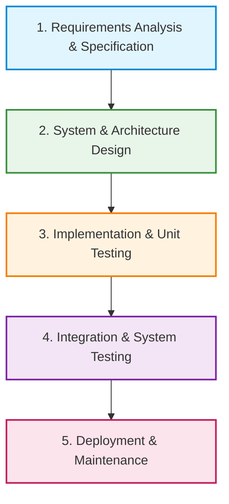

# RUET CSE 3206 — Software Engineering Sessional
# Lab 2 Master Specification: Insurance Claim System (Group 21)

---

> **Executive Note:**  
> This specification document consolidates **every single detail, guideline, rubric, deliverable, and theoretical requirement** from `lab_2.pdf` issued by the Department of Computer Science & Engineering, Rajshahi University of Engineering & Technology (RUET).  
> **No team member needs to open the PDF again.** Everything required for the **Project Design Report**, **GitHub Workflow**, **MVP Development**, and **Viva Preparation** is thoroughly detailed below.

---

## Table of Contents
1. [Academic & Course Metadata](#1-academic--course-metadata)
2. [Group 21 Profile & Assigned Scenario](#2-group-21-profile--assigned-scenario)
3. [Lab Overview & Core Objectives](#3-lab-overview--core-objectives)
4. [Phase 1: Requirement Analysis](#4-phase-1-requirement-analysis)
   - 4.1 [Project Overview](#41-project-overview)
   - 4.2 [Problem Statement](#42-problem-statement)
   - 4.3 [Project Objectives](#43-project-objectives)
   - 4.4 [Stakeholder Analysis](#44-stakeholder-analysis)
   - 4.5 [Project Scope (In-Scope vs. Out-of-Scope)](#45-project-scope-in-scope-vs-out-of-scope)
   - 4.6 [Functional Requirements (FR-01 to FR-12)](#46-functional-requirements-minimum-10-required)
   - 4.7 [Non-Functional Requirements (NFR-01 to NFR-10)](#47-non-functional-requirements-minimum-8-required)
   - 4.8 [User Stories & Use Cases (5 Comprehensive Scenarios)](#48-user-stories--use-cases-5-required)
   - 4.9 [Assumptions and Constraints](#49-assumptions-and-constraints)
5. [Phase 2: Software Process Model Selection & Justification](#5-phase-2-software-process-model-selection--justification)
   - 5.1 [Models Studied in Lab](#51-models-studied-in-lab)
   - 5.2 [Selected Model: Waterfall Model](#52-selected-model-waterfall-model)
   - 5.3 [Detailed Suitability Justification](#53-detailed-suitability-justification)
   - 5.4 [Comparison with Alternative Models](#54-comparison-with-alternative-models)
   - 5.5 [Waterfall Lifecycle Stages Applied to Insurance Claim System](#55-waterfall-lifecycle-stages-applied-to-our-project)
6. [Phase 3: MVP Design & Core Functionality](#6-phase-3-mvp-design--core-functionality)
   - 6.1 [MVP Philosophy & Guidelines](#61-mvp-philosophy--guidelines)
   - 6.2 [Core Functional Modules for the MVP](#62-core-functional-modules-for-the-mvp)
   - 6.3 [Recommended Architectural Strategy](#63-recommended-architectural-strategy)
   - 6.4 [Sample Data & Seed Records](#64-sample-data--seed-records)
7. [Phase 4: GitHub Collaboration & Workflow Guidelines](#7-phase-4-github-collaboration--workflow-guidelines)
   - 7.1 [Branching Model](#71-branching-model)
   - 7.2 [Individual Team Member Responsibilities](#72-individual-team-member-responsibilities)
   - 7.3 [Mandatory GitHub Activities Checklist](#73-mandatory-github-activities-checklist)
   - 7.4 [Git Commit Message Conventions](#74-git-commit-message-conventions)
8. [Repository Directory Structure Standard](#8-repository-directory-structure-standard)
9. [Project Design Report Structure (16 Mandatory Sections)](#9-project-design-report-structure-16-mandatory-sections)
10. [Evaluation Rubric & Marks Distribution (Total: 10 Marks)](#10-evaluation-rubric--marks-distribution-total-10-marks)
11. [Expected Deliverables Checklist](#11-expected-deliverables-checklist)
12. [Master Course Reference: All 60 Project Scenarios](#12-master-course-reference-all-60-project-scenarios)

---

## 1. Academic & Course Metadata

| Parameter | Details |
| :--- | :--- |
| **Institution** | **Rajshahi University of Engineering & Technology (RUET)** |
| **Location** | Rajshahi-6204, Bangladesh |
| **Motto** | *Heaven's light is our guide* |
| **Department** | **Department of Computer Science & Engineering (CSE)** |
| **Course Code** | **CSE 3206** |
| **Course Title** | **Software Engineering Sessional** |
| **Lab Identification** | **#Lab 2: Software Process Models, Requirement Analysis & MVP Development** |
| **Total Marks** | **10 Marks** |
| **Course Outcome (CO)** | **CO2:** Design and implement software solutions that effectively address user requirements and enhance system reliability and performance. |
| **Program Outcome (PO)** | **PO3:** Design and Development of Software Solutions |
| **Assessment Instruments** | 1. Project Design Report (PDF in `docs/Requirement_Report.pdf`)<br>2. Shared GitHub Repository & Collaboration History<br>3. MVP Working Demonstration<br>4. Individual Viva Voce |

---

## 2. Group 21 Profile & Assigned Scenario

| Attribute | Official Specification |
| :--- | :--- |
| **Group Number** | **Group 21** |
| **Assigned Team Name** | **`Group#01 from Section B (1st 30)`** |
| **Project Title** | **Insurance Claim System** |
| **Suggested Best Process Model** | **Waterfall** |
| **Team Capacity** | **3 Members** |
| **Project Duration** | **Semester-Long Project:** Lab 2 is Milestone 1; future labs build directly upon this codebase (Design Patterns, Refactoring, Unit/Integration Testing, CI/CD). |
| **Technology Freedom** | Teams may use any programming language, framework, database, IDE, or development platform. |
| **Key Evaluation Priority** | **Engineering methodology, teamwork, design decisions, and documentation will be valued over raw feature complexity.** |

---

## 3. Lab Overview & Core Objectives

### 3.1 Simulated Scenario
Each 3-member team operates as an independent software development engineering firm that has been awarded a formal contract by a client. The client has presented a real-world scenario: building a robust, auditable, and reliable **Insurance Claim System**.

### 3.2 Primary Team Responsibilities
1. **Analyze Client Requirements:** Conduct systematic requirement analysis covering functional, non-functional, stakeholder, and constraint dimensions.
2. **Select & Justify Process Model:** Formally adopt the **Waterfall Model**, document why it is uniquely suited for an insurance claim adjudication platform, and contrast it with alternative models.
3. **Design & Implement an MVP:** Construct a working prototype demonstrating the end-to-end claim lifecycle (submission $\rightarrow$ review $\rightarrow$ approval/rejection) with clean code and modular structure.
4. **Collaborate via Git/GitHub:** Establish individual feature branches, meaningful commit histories, pull requests (PRs), code reviews, and clean merges.
5. **Document Decisions:** Compile a formal 16-section **Project Design Report** exported as `docs/Requirement_Report.pdf`.

---

## 4. Phase 1: Requirement Analysis

### 4.1 Project Overview
The **Insurance Claim System (ICS)** is an enterprise web application designed to digitize and streamline the insurance claim lifecycle. It connects policyholders, claim adjusters, and administrators into a centralized platform. The system eliminates paper-heavy manual submission, prevents data loss, reduces fraudulent claims, accelerates claim adjudication, and guarantees an immutable audit trail for every status change and payout decision.

### 4.2 Problem Statement
Traditional insurance claim processing faces critical systemic bottlenecks:
1. **Manual & Slow Processing:** Claimants submit physical paperwork and receipts, causing claim processing times of several weeks or months.
2. **Lack of Transparency:** Policyholders have zero real-time visibility into claim progress, leading to excessive support inquiries and frustration.
3. **High Human Error & Inconsistency:** Manual assessment increases data entry mistakes, misplacement of evidence, and inconsistent claim calculations.
4. **Fraud Vulnerability & Audit Gaps:** Without automated validation and timestamped audit logs, detecting duplicate claims, fraudulent filings, or unauthorized approvals is difficult.
5. **Inefficient Adjuster Workflows:** Adjusters lack a consolidated queue to prioritize, inspect attached evidence, record findings, and issue formal settlements.

### 4.3 Project Objectives
- **Digitize Filing:** Provide a self-service portal for policyholders to submit claims and upload digital evidence anytime, anywhere.
- **Automate Workflow Pipeline:** Implement a deterministic claim adjudication state machine (`Submitted` $\rightarrow$ `Under Review` $\rightarrow$ `Approved` / `Rejected` $\rightarrow$ `Settled`).
- **Real-Time Visibility:** Provide role-specific dashboards with instant visual status indicators for policyholders and adjusters.
- **Audit & Compliance Guarantee:** Maintain immutable timestamps, reviewer IDs, and decision notes for every action taken on a claim.
- **Modular Architecture:** Lay a clean, maintainable, and testable codebase for upcoming semester labs on Design Patterns and Testing.

### 4.4 Stakeholder Analysis

```text
┌────────────────────────────────────────────────────────────────────────┐
│                        INSURANCE CLAIM SYSTEM                          │
└───────┬──────────────────────────┬─────────────────────────────┬───────┘
        │                          │                             │
┌───────▼───────────┐      ┌───────▼───────────┐         ┌───────▼───────────┐
│   POLICYHOLDER    │      │  CLAIMS ADJUSTER  │         │   ADMINISTRATOR   │
│   (Claimant)      │      │   / EXAMINER      │         │   / AUDITOR       │
├───────────────────┤      ├───────────────────┤         ├───────────────────┤
│ • Files claims    │      │ • Reviews queue   │         │ • System oversight│
│ • Attaches proof  │      │ • Verifies policy │         │ • Manages users   │
│ • Tracks status   │      │ • Assesses loss   │         │ • High-level stats│
│ • Views decisions │      │ • Approves/Rejects│         │ • Audit trails    │
└───────────────────┘      └───────────────────┘         └───────────────────┘
```

1. **Policyholder (Claimant):**
   - *Role:* Insured individual who has suffered an insurable loss.
   - *Needs:* Simple submission form, instant confirmation, transparent status tracking, and clear payout rationale.
2. **Claims Adjuster / Examiner:**
   - *Role:* Licensed insurance professional responsible for investigating claims, assessing damage, checking policy limits, and adjudicating liability.
   - *Needs:* Organized pending queue, inspection of attached evidence, decision tools (Approve with amount / Reject with reason), and note-taking features.
3. **Insurance Administrator / Manager:**
   - *Role:* Operations manager overseeing company-wide performance, claim settlement totals, fraud alerts, and staff activities.
   - *Needs:* Aggregated statistics, user management, and compliance oversight.
4. **Auditor / Regulatory Authority:**
   - *Role:* Internal or government compliance body enforcing statutory insurance laws.
   - *Needs:* Tamper-evident logs, date/time stamps, and transparent historical records.

### 4.5 Project Scope (In-Scope vs. Out-of-Scope)

| Category | In-Scope (MVP & Semester Project) | Out-of-Scope (Future / Production) |
| :--- | :--- | :--- |
| **Authentication** | Multi-role local authentication (Policyholder, Adjuster, Admin) | Biometric login, OAuth2 / Social Login |
| **Claim Types** | Auto, Health, Home, Life insurance claims | Complex maritime/commercial cargo underwriting |
| **Submission** | Form data (incident date, amount, category, description) + file/evidence reference | AI-based automated optical damage estimation from photos |
| **Adjudication** | Adjuster review, approval/rejection, approved amount, review notes | Live external banking wire transfer APIs |
| **Tracking** | Deterministic stage progression & status history | Automated SMS / WhatsApp messaging gateway |
| **Data Storage** | Relational / structured data schema with CRUD & seed data | Multi-region geo-replicated enterprise database clusters |

### 4.6 Functional Requirements (Minimum 10 Required)

| Req ID | Requirement Name | Description |
| :---: | :--- | :--- |
| **FR-01** | **User Authentication & Role Identification** | System shall allow users to log in securely with email and password and automatically redirect them based on their role (`Policyholder` or `Adjuster`/`Admin`). |
| **FR-02** | **Policy Selection & Validation** | Policyholder shall select an active policy (e.g., Auto, Health, Property) associated with their account before submitting a claim. |
| **FR-03** | **Claim Submission Form** | System shall provide a form capturing incident date, claim type, claimed amount, location/summary, and detailed description of the incident. |
| **FR-04** | **Digital Evidence Attachment** | Policyholders shall attach supporting evidence (receipts, police reports, photographs, medical invoices) with preview capabilities. |
| **FR-05** | **Claim Status Pipeline** | System shall maintain a strict state lifecycle: `Submitted` $\rightarrow$ `Under Review` $\rightarrow$ `Approved` / `Rejected` $\rightarrow$ `Settled`. |
| **FR-06** | **Policyholder Dashboard** | Policyholders shall view a dashboard summarizing their total claims, pending claims, approved payouts, and recent submissions. |
| **FR-07** | **Adjuster Review Queue** | Adjusters shall have an inspection queue displaying all pending and in-review claims with filtering by status and claim type. |
| **FR-08** | **Claim Adjudication Decision** | Adjuster shall formally approve a claim (specifying approved payout amount) or reject it (specifying a mandatory rejection reason). |
| **FR-09** | **Claim Modification / Cancellation** | Policyholders shall be able to edit or cancel a claim *only* while it remains in `Submitted` status (before adjuster review begins). |
| **FR-10** | **Audit Trail & Decision Logging** | System shall record a timestamped history log for each claim, recording who changed the status, the previous state, the new state, and review comments. |
| **FR-11** | **Search, Filter & Sort** | System shall allow users to search claims by Claim ID, filter by category or status, and sort by date or amount. |
| **FR-12** | **Seed Data & Sample Management** | System shall include pre-populated policies, sample claims across various stages, and test user accounts for immediate evaluation. |

### 4.7 Non-Functional Requirements (Minimum 8 Required)

| Req ID | Category | Specification |
| :---: | :--- | :--- |
| **NFR-01** | **Security & Access Control** | Passwords must be hashed; API endpoints must enforce role-based access control so policyholders cannot access adjuster endpoints or another user's claims. |
| **NFR-02** | **Data Integrity & Consistency** | Financial values must maintain strict 2-decimal precision. Claim state transitions must be atomic to prevent invalid status jumps. |
| **NFR-03** | **Performance & Response Time** | All core API operations (login, claim submission, status update) must execute with a response time under $500\text{ ms}$ under normal conditions. |
| **NFR-04** | **Availability & Reliability** | The system must gracefully handle validation errors, return standardized error payloads, and ensure no loss of claim form data during failed submissions. |
| **NFR-05** | **Usability & UX Simplicity** | The user interface must be clean, modern, responsive, and intuitive, adhering to consistent UI layout, color-coded badges, and clear feedback alerts. |
| **NFR-06** | **Modularity & Layered Design** | Codebase must strictly separate presentation, routing, controller/business logic, and data storage to enable clean unit testing and future design pattern integration. |
| **NFR-07** | **Testability** | Core domain logic (claim validation, status transition rules, payout calculations) must be isolated into pure functions/classes suitable for automated testing in Lab 3/4. |
| **NFR-08** | **Auditability & Traceability** | Every claim state transition must be permanently recorded with timestamp, actor ID, action type, and comments for statutory compliance. |
| **NFR-09** | **Portability & Cross-Browser Compatibility** | The web application must function identically across all standard modern web browsers (Google Chrome, Mozilla Firefox, Microsoft Edge, Apple Safari). |
| **NFR-10** | **Maintainability & Extensibility** | Code must adhere to consistent linting, TypeScript/JavaScript type safety, and clean documentation to facilitate seamless onboarding of all 3 team members. |

### 4.8 User Stories & Use Cases (5 Required)

#### User Story 1: Online Claim Submission
- **As a** registered Policyholder,
- **I want to** submit a digital claim with incident details, loss amount, and supporting document links,
- **So that** I can file my insurance claim immediately without traveling to a physical branch or filling manual paper forms.
- **Acceptance Criteria:**
  1. System validates that the claimed amount is positive and does not exceed policy coverage limit.
  2. Incident date cannot be in the future.
  3. System assigns a unique `Claim ID` and sets initial status to `Submitted`.

#### User Story 2: Real-Time Claim Status Tracking
- **As a** Policyholder,
- **I want to** track the live status and audit timeline of my submitted claim,
- **So that** I know exactly when my claim is picked up for review and what decision was reached.
- **Acceptance Criteria:**
  1. Policyholder dashboard displays a visual progress pipeline (`Submitted` $\rightarrow$ `Under Review` $\rightarrow$ `Approved`/`Rejected`).
  2. Clicking on a claim displays decision notes and approved settlement amount if completed.

#### User Story 3: Adjuster Claims Inspection & Queue Management
- **As a** Claims Adjuster,
- **I want to** view a prioritized queue of pending claims and inspect all attached evidence,
- **So that** I can assess the validity and severity of each loss before making a decision.
- **Acceptance Criteria:**
  1. Claims queue displays filter options for `All`, `Submitted`, `Under Review`, `Approved`, `Rejected`.
  2. Adjuster can move a claim from `Submitted` to `Under Review` to indicate active investigation.

#### User Story 4: Claim Adjudication (Approval / Rejection)
- **As a** Claims Adjuster,
- **I want to** formally approve or reject a claim with settlement amounts and review remarks,
- **So that** legitimate claims are paid accurately and suspicious or uncovered claims are formally documented and denied.
- **Acceptance Criteria:**
  1. If approved, adjuster must input an `Approved Amount` ($\le$ `Claimed Amount` and $\le$ `Coverage Limit`).
  2. If rejected, adjuster must supply a mandatory `Rejection Reason`.
  3. Action timestamp and adjuster identification are permanently appended to the claim log.

#### User Story 5: Administrator Operational Dashboard
- **As an** Insurance Administrator,
- **I want to** view high-level metrics on total claims filed, approval rates, total payout disbursement, and system audit logs,
- **So that** I can monitor financial liability, prevent fraud, and ensure claims adjusters meet operational SLAs.
- **Acceptance Criteria:**
  1. Dashboard displays total claims, approved claims, rejected claims, and total currency settled.
  2. Admin can inspect all historical logs across all users and policies.

### 4.9 Assumptions and Constraints
- **Assumptions:**
  - Users have access to modern web browsers and desktop/laptop devices.
  - Policyholders already hold verified, active policies within the system.
  - Documents and evidence are provided via valid file attachments or accessible digital URLs.
- **Constraints:**
  - Strict Waterfall methodology lifecycle must be observed for documentation before code changes.
  - Lab 2 timeline requires delivering a functional MVP rather than an exhaustive commercial product.
  - Financial payments are simulated logically within the database without live payment gateway integrations.

---

## 5. Phase 2: Software Process Model Selection & Justification

### 5.1 Models Studied in Lab
The lab syllabus examines 8 primary process models:
1. **Waterfall**
2. **Incremental**
3. **Prototype**
4. **Spiral**
5. **Rapid Application Development (RAD)**
6. **Agile XP**
7. **Scrum**
8. **Kanban**

### 5.2 Selected Model: Waterfall Model
For **Group 21 (Insurance Claim System)**, the designated and selected software development model is the **Waterfall Model**.



### 5.3 Detailed Suitability Justification
The Waterfall Model is uniquely appropriate for the **Insurance Claim System** due to several structural characteristics of the insurance domain:
1. **High Regulatory & Statutory Compliance:**
   - Insurance is a heavily regulated financial sector governed by strict insurance laws, financial auditing standards, and legal liability principles.
   - Requirements, approval hierarchies, claim limits, and appeal processes are defined by policy contracts upfront and cannot change arbitrarily during development.
2. **Low Tolerance for Ambiguity & Defects:**
   - In financial software handling claim disbursements, logic bugs can result in catastrophic financial losses or legal lawsuits.
   - Waterfall enforces rigorous, comprehensive requirement analysis and formal design before a single line of production code is written.
3. **Clear, Deterministic Sequential Stages:**
   - The lifecycle of an insurance claim (`Filing` $\rightarrow$ `Investigation` $\rightarrow$ `Adjudication` $\rightarrow$ `Settlement`) mirrors the linear, milestone-driven progression of the Waterfall methodology.
4. **Comprehensive Documentation & Audit Trail:**
   - Regulatory bodies require exhaustive documentation of system specifications, data models, and verification steps. Waterfall's document-driven nature ensures compliance artifacts are produced at each stage.
5. **Predictable Milestone Delivery for Academic Assessment:**
   - In the context of RUET CSE 3206, Lab 2 explicitly evaluates Requirement Analysis (Phase 1) and Design (Phase 2 & 3) prior to subsequent lab milestones.

### 5.4 Comparison with Alternative Models

#### Comparison 1: Waterfall vs. Agile Scrum
- **Why Agile Scrum is Less Suitable:**
  - Agile Scrum relies on iterative sprints, emergent requirements, and continuous customer pivoting.
  - In an insurance claim system, the core contractual rules and claim processing stages are legally predetermined. Constantly shifting requirements sprint-to-sprint introduces severe regulatory compliance risks.
  - Scrum often deprioritizes exhaustive upfront architectural and legal documentation in favor of working software, creating audit risks for financial systems.

#### Comparison 2: Waterfall vs. Prototyping Model
- **Why Prototyping is Less Suitable:**
  - Prototyping is optimal when clients are uncertain of what they want (e.g., innovative social media apps or game concepts) and require visual feedback to define scope.
  - For insurance claim systems, business logic, statutory constraints, and claim workflows are well-understood and mature.
  - Rapid throwaway prototyping risks expending development resources on cosmetic UI iterations while neglecting back-end transaction integrity, data security, and audit trail architectures.

#### Comparison 3: Waterfall vs. Spiral Model
- **Why Spiral is Less Suitable:**
  - The Spiral Model focuses heavily on continuous, high-overhead risk assessment cycles and expensive simulations for high-uncertainty R&D projects (e.g., aerospace defense, autonomous driving).
  - Building a web-based insurance claim system presents well-understood technical risks that do not justify the prohibitive management overhead and complexity of multiple spiral iterations.

### 5.5 Waterfall Lifecycle Stages Applied to Our Project

```text
┌───────────────────────────┬──────────────────────────────────────────────────────────────┐
│ Waterfall Phase           │ Execution in Group 21 Insurance Claim System                 │
├───────────────────────────┼──────────────────────────────────────────────────────────────┤
│ 1. Requirements Analysis  │ Elicit 12 FRs, 10 NFRs, 5 User Stories, Stakeholder Matrix   │
│ 2. System Design          │ Layered Architecture, REST API specs, ER Schema, UI Wireframes│
│ 3. Implementation (MVP)   │ React frontend, Node/Express backend, Modular TypeScript     │
│ 4. Integration & Testing  │ End-to-end claim flow testing, Git PR reviews, Merge to main │
│ 5. Review & Maintenance  │ Project Design Report (PDF), Demo recording, Viva preparation│
└───────────────────────────┴──────────────────────────────────────────────────────────────┘
```

---

## 6. Phase 3: MVP Design & Core Functionality

### 6.1 MVP Philosophy & Guidelines
- **Demonstrate Feasibility:** The goal of Lab 2 is to demonstrate a viable, working prototype of the core insurance workflow rather than building a sprawling, complex system.
- **Maintain Small, Functional, Modular Design:** Keep components decoupled to allow future labs on Design Patterns (Factory, Strategy, Observer) and Unit Testing to build on top seamlessly.
- **Focus on Software Engineering Quality:** Code cleanliness, robust error handling, role-based navigation, and clean API design take precedence over cosmetic fluff.

### 6.2 Core Functional Modules for the MVP

```text
┌───────────────────────────────────────────────────────────────────────────────┐
│                        CORE MVP ARCHITECTURE MODULES                          │
├───────────────────────┬───────────────────────────────┬───────────────────────┤
│ 1. AUTH & ROLE MODULE │ 2. CLAIM SUBMISSION MODULE    │ 3. ADJUDICATION QUEUE │
├───────────────────────┼───────────────────────────────┼───────────────────────┤
│ • Quick Role Switcher │ • Policy Selection (Auto,     │ • Filterable Queue    │
│   (Policyholder vs    │   Health, Home, Life)         │   (All, Submitted,    │
│   Adjuster/Admin)     │ • Incident Form (Date, Loss   │   Under Review, etc.) │
│ • Session State       │   Amount, Description)        │ • Evidence Viewer     │
│ • Secure Mock/Token   │ • Evidence/Document URL link  │ • Decision Controls   │
│   Auth Flow           │ • Client-side Validation      │   (Approve / Reject)  │
├───────────────────────┴───────────────────────────────┴───────────────────────┤
│ 4. DASHBOARD & ANALYTICS MODULE       │ 5. AUDIT LOG & HISTORY MODULE         │
├───────────────────────────────────────┼───────────────────────────────────────┤
│ • Total claims, Pending, Approved     │ • Immutable timestamped trail         │
│ • Total financial settlement amount   │ • Records actor, old state, new state │
│ • Visual pipeline badge indicators    │ • Reviewer remarks and rationale      │
└───────────────────────────────────────┴───────────────────────────────────────┘
```

1. **Authentication & Role Switcher:**
   - Quick demo authentication allowing the evaluator to switch between a **Policyholder** (e.g., `alice@example.com`) and a **Claims Adjuster** (e.g., `adjuster@insurance.com`).
2. **Policyholder Claim Submission:**
   - Policy selection (Health, Auto, Home).
   - Form fields: Incident Date, Claim Category, Claimed Amount (\$), Incident Location, Description, and Evidence URL/Attachment.
   - Validation against future dates, negative amounts, or missing fields.
3. **Claim Status Pipeline & Tracking:**
   - Visual step progress bar showing: `Submitted` $\rightarrow$ `Under Review` $\rightarrow$ `Approved` or `Rejected` $\rightarrow$ `Settled`.
4. **Claims Adjuster Review & Adjudication:**
   - Filter claims by status.
   - Detailed modal/view to inspect claimant details, incident description, and evidence.
   - Decision controls:
     - **Move to In Review:** Flags claim as actively investigated.
     - **Approve Claim:** Input approved payout amount and settlement notes.
     - **Reject Claim:** Input formal rejection justification.
5. **Analytical Dashboards:**
   - Summary cards displaying Total Claims, Claims In Review, Approved Claims, Rejected Claims, and Total Disbursed Amount.

### 6.3 Recommended Architectural Strategy
- **Frontend (`src/frontend`):**
  - Modern React 19 + TypeScript + Vite.
  - Modern, responsive styling (Tailwind CSS or clean semantic CSS with Glassmorphic design cards).
  - Clear separation into `components/`, `pages/`, `services/`, and `types/`.
- **Backend (`src/backend`):**
  - Node.js + Express + TypeScript.
  - Layered architecture: `controllers/`, `routes/`, `models/`, `middleware/`, `data/`.
  - In-memory / file-based JSON repository with full CRUD operations to ensure zero complicated external database setup needed during live evaluation.
- **RESTful Endpoints:**
  - `POST /api/auth/login` — Authenticate and return user profile & role.
  - `GET /api/policies` — List available policies for policyholder.
  - `GET /api/claims` — List claims (filtered by user or all for adjuster).
  - `GET /api/claims/:id` — Get single claim with audit logs.
  - `POST /api/claims` — Submit a new claim.
  - `PUT /api/claims/:id/status` — Adjuster updates status and decision.
  - `GET /api/dashboard/stats` — Aggregate metrics for admin dashboard.

### 6.4 Sample Data & Seed Records
To ensure zero friction during the viva demonstration, the MVP includes pre-seeded data:
- **Test Users:**
  - Policyholder: `alice@ruet.ac.bd` (Role: Policyholder, Active Policies: Auto, Health)
  - Policyholder: `bob@ruet.ac.bd` (Role: Policyholder, Active Policies: Home)
  - Adjuster: `charlie.adjuster@ruet.ac.bd` (Role: Adjuster, License: RUET-ADJ-2026)
  - Administrator: `admin@ruet.ac.bd` (Role: Administrator)
- **Pre-loaded Claims:**
  - Claim #CLM-1001: Auto Accident Claim (\$2,500) — Status: `Approved` (\$2,200 settled)
  - Claim #CLM-1002: Medical Hospitalization (\$4,800) — Status: `Under Review`
  - Claim #CLM-1003: Property Storm Damage (\$12,000) — Status: `Submitted`
  - Claim #CLM-1004: Water Pipe Leakage (\$1,500) — Status: `Rejected` (Pre-existing wear)

---

## 7. Phase 4: GitHub Collaboration & Workflow Guidelines

### 7.1 Branching Model

```text
main (Production / Stable Release)
 │
 ├── member1-feature (e.g., feature/auth-and-models)
 ├── member2-feature (e.g., feature/claim-submission-ui)
 └── member3-feature (e.g., feature/adjuster-adjudication-pipeline)
```

### 7.2 Individual Team Member Responsibilities
Each of the 3 teammates must have equal, distinct, and visible contributions:

| Teammate | Assigned Role | Primary Feature Branch | Core Responsibilities |
| :--- | :--- | :--- | :--- |
| **Member 1** | **Backend & Architecture Lead** | `member1-feature` or `feat/backend-api-core` | - Project initialization & Express server setup<br>- Data models (User, Policy, Claim, AuditLog)<br>- RESTful API endpoints & Seed data<br>- Requirement Report: Sections 1–5, 10–12 |
| **Member 2** | **Frontend & Submission Lead** | `member2-feature` or `feat/claim-submission-portal` | - React application layout & navigation<br>- Policyholder Dashboard & Policy view<br>- Claim Submission form with validation<br>- Requirement Report: Sections 6–9 |
| **Member 3** | **Adjudication & Audit Lead** | `member3-feature` or `feat/adjuster-dashboard-audit` | - Adjuster review queue & filters<br>- Claim approval/rejection modal & decision workflow<br>- Audit history timeline & Admin analytics<br>- Requirement Report: Sections 13–16 |

### 7.3 Mandatory GitHub Activities Checklist
The course grading strictly audits GitHub activities. All teams must verify:
- [ ] **Repository Creation:** Repository initialized with clear description and MIT/Academic license.
- [ ] **Comprehensive README.md:** Professional documentation detailing setup, screenshots, and team credits.
- [ ] **Minimum 3 Feature Branches:** At least 3 separate feature branches created and pushed to GitHub.
- [ ] **Minimum 3 Pull Requests (PRs):** Each member opens a PR from their branch to `main`.
- [ ] **Code Reviews on PRs:** Team members leave constructive review comments on peers' PRs before approval.
- [ ] **Branch Merging:** Successful merge of all 3 PRs into `main` without unresolved conflicts.
- [ ] **Meaningful Commit History:** Consistent conventional commit messages showing chronological development.

### 7.4 Git Commit Message Conventions
Follow the Conventional Commits specification:
- `feat: <description>` — A new feature (e.g., `feat: implement claim submission validation`)
- `fix: <description>` — A bug fix (e.g., `fix: prevent negative claim amount input`)
- `docs: <description>` — Documentation updates (e.g., `docs: add Waterfall justification to report`)
- `style: <description>` — Formatting, UI styling changes
- `refactor: <description>` — Code refactoring without changing functionality
- `test: <description>` — Adding test cases or mock data

---

## 8. Repository Directory Structure Standard

The repository must strictly adhere to the file and folder layout prescribed in `lab_2.pdf`:

```text
insurance-claim-system/
├── README.md                      # Primary repository documentation & overview
├── PROJECT_SPECIFICATION.md       # Complete master lab specification (this document)
├── lab_2.pdf                      # Original university assignment handout
│
├── docs/                          # Official documentation directory
│   ├── Requirement_Report.pdf     # 16-Section formal Project Design Report
│   └── architecture_diagram.png   # Architecture & state machine diagrams
│
├── src/                           # Complete source code
│   ├── backend/                   # Express + TypeScript API Server
│   │   ├── src/
│   │   │   ├── controllers/       # Route handlers (auth, claims, policies)
│   │   │   ├── models/            # TypeScript interfaces & types
│   │   │   ├── data/              # In-memory storage & seed claims
│   │   │   ├── routes/            # Express router definitions
│   │   │   └── server.ts          # Server entry point
│   │   ├── package.json
│   │   └── tsconfig.json
│   │
│   └── frontend/                  # React + TypeScript + Vite Client
│       ├── src/
│       │   ├── components/        # UI widgets (Navbar, StatCard, Badge, ClaimModal)
│       │   ├── pages/             # PolicyholderPortal, AdjusterPortal, AdminAnalytics
│       │   ├── services/          # API client calling backend endpoints
│       │   ├── types/             # Shared frontend type definitions
│       │   ├── App.tsx            # Main application component & routing
│       │   └── main.tsx           # React DOM root
│       ├── package.json
│       └── vite.config.ts
│
├── assets/                        # Diagrams, logos, RUET branding assets
│   └── logo.png
│
└── screenshots/                   # Working MVP demonstration screenshots
    ├── 01_policyholder_dashboard.png
    ├── 02_claim_submission_form.png
    ├── 03_adjuster_review_queue.png
    ├── 04_claim_adjudication_modal.png
    └── 05_audit_trail_history.png
```

---

## 9. Project Design Report Structure (16 Mandatory Sections)

The report submitted in `docs/Requirement_Report.pdf` must be structured into exactly 16 numbered sections as mandated on page 3 of `lab_2.pdf`:

| Section # | Section Title | Content & Guidance for Group 21 |
| :---: | :--- | :--- |
| **1** | **Cover Page** | RUET Department of CSE heading, Course Code (CSE 3206), Lab #2, Project Title: *Insurance Claim System*, Group 21 (`Group#01 Section B`), Submission Date, Course Instructors. |
| **2** | **Team Information** | Table with 3 members: Full Name, Student Roll/ID, Section, Email, Assigned Roles & Responsibilities. |
| **3** | **Project Title** | "Insurance Claim System" with formal project subtitle and version metadata. |
| **4** | **Problem Statement** | Exhaustive analysis of manual insurance processing delays, fraud vulnerabilities, lack of transparency, and paper-based inefficiencies. |
| **5** | **Project Objectives** | Specific, measurable goals: Digitizing claim submission, automated state progression, auditable adjudication, role-based security. |
| **6** | **Stakeholder Analysis** | Matrix identifying Policyholder, Claims Adjuster, Administrator, and Regulatory Auditor with their responsibilities and system interactions. |
| **7** | **Functional Requirements** | Formal tabular specification of all 12 Functional Requirements (FR-01 to FR-12) with IDs, descriptions, and priorities. |
| **8** | **Non-functional Requirements** | Formal tabular specification of all 10 Non-Functional Requirements (NFR-01 to NFR-10) covering Security, Integrity, Performance, etc. |
| **9** | **User Stories / Use Cases** | 5 detailed user stories with "As a / I want / So that" structure, detailed acceptance criteria, and corresponding use case diagrams. |
| **10** | **Selected Software Process Model** | Explicit declaration of the **Waterfall Model** as assigned to Group 21. |
| **11** | **Justification of Process Model** | Deep domain rationale: legal regulations, contractual immutability, zero-defect financial risk, sequential adjudication stages, document-driven compliance. |
| **12** | **Comparison with Alternative Models** | Comparative evaluation contrasting Waterfall with Agile Scrum, Prototyping, and Spiral models, highlighting why they are less suitable. |
| **13** | **MVP Design Overview** | High-level system architecture, client-server component diagrams, database schema/data models, and state transition flowcharts. |
| **14** | **GitHub Collaboration Evidence** | Documented screenshots of GitHub repository homepage, commit graph, branch list (`member1`, `member2`, `member3`), PRs, code reviews, and merged commits. |
| **15** | **Challenges Encountered** | Detailed technical, architectural, and collaborative hurdles encountered during development and how the team engineered solutions. |
| **16** | **Conclusion** | Summary of deliverables achieved, milestone reflection, and roadmap for applying Design Patterns and Testing in upcoming labs. |

---

## 10. Evaluation Rubric & Marks Distribution (Total: 10 Marks)

| Criteria | Excellent (100%) | Good (80%) | Satisfactory (60%) | Needs Improvement (40%) | Allocated Marks |
| :--- | :--- | :--- | :--- | :--- | :---: |
| **1. Requirement Analysis** | Clearly identifies stakeholders, project scope, and comprehensive functional & non-functional requirements. | Minor omissions in requirements or stakeholder analysis. | Basic requirements identified with limited analysis. | Requirements incomplete or unclear. | **3 Marks** |
| **2. Software Process Model Selection & Justification** | Appropriate process model selected with strong justification and comparison with alternatives. | Appropriate model selected with adequate justification. | Model selected with limited justification. | Model selection inappropriate or lacks justification. | **2 Marks** |
| **3. Mini Project (MVP) Design & Implementation** | Functional MVP demonstrating core requirements with good design and organization. | MVP implemented with minor missing features. | Basic prototype developed with limited functionality. | Prototype incomplete or non-functional. | **2 Marks** |
| **4. GitHub Collaboration** | Proper repository, individual branches, meaningful commits, pull requests, and successful merge by all members. | Repository and branches maintained with minor issues. | Limited GitHub collaboration; few commits or branches. | Little or no evidence of collaborative GitHub workflow. | **2 Marks** |
| **5. Project Design Report & Presentation** | Well-organized report with complete documentation and professional presentation. | Report mostly complete with minor deficiencies. | Basic report with limited explanation. | Poorly organized or incomplete report. | **1 Mark** |
| **TOTAL** | | | | | **10 Marks** |

### Official RUET Performance Level Benchmark:
- **Excellent:** $90\% - 100\%$ ($9.0 - 10.0$ Marks)
- **Good:** $75\% - 89\%$ ($7.5 - 8.9$ Marks)
- **Satisfactory:** $60\% - 74\%$ ($6.0 - 7.4$ Marks)
- **Needs Improvement:** Below $60\%$ ($< 6.0$ Marks)

---

## 11. Expected Deliverables Checklist

To achieve a full 10/10 mark, Group 21 must submit and demonstrate:

1. **GitHub Repository:**
   - [ ] Clean repository with `README.md`, `src/`, `docs/`, `assets/`, `screenshots/`.
   - [ ] Verified commit history with contributions from all 3 members.
   - [ ] 3 distinct feature branches corresponding to member tasks.
   - [ ] 3 merged Pull Requests with peer review comments.
2. **Project Design Report (PDF):**
   - [ ] Stored at `docs/Requirement_Report.pdf`.
   - [ ] Fully formatted with all 16 designated sections.
   - [ ] Includes GitHub contribution screenshots and architecture diagrams.
3. **MVP Working Prototype:**
   - [ ] Instant startup (frontend on Vite, backend on Express).
   - [ ] Functional role switching (Policyholder, Adjuster, Admin).
   - [ ] Policy selection and claim submission with validation.
   - [ ] Adjuster review, approval/rejection decision, and payout input.
   - [ ] Immutable audit log viewable in real-time.
4. **Individual Viva Voce:**
   - [ ] Each member can articulate their specific code contributions.
   - [ ] Each member can justify why Waterfall was selected over Agile and Prototyping.
   - [ ] Each member can explain how this MVP prepares for future design patterns.

---

## 12. Master Course Reference: All 60 Project Scenarios

For complete cross-reference with the university lab allocation sheet:

| Grp # | Project Scenario | Suggested Process Model | Assigned Team Name / Section |
| :---: | :--- | :--- | :--- |
| 1 | University Course Registration System | Agile Scrum | Group#01 from Section A (1st 30) |
| 2 | Online Book Store | Incremental | Group#02 from Section A (1st 30) |
| 3 | Hospital Appointment System | Spiral | Group#03 from Section A (1st 30) |
| 4 | Restaurant Ordering System | Prototype | Group#04 from Section A (1st 30) |
| 5 | Smart Parking System | Agile XP | Group#05 from Section A (1st 30) |
| 6 | Pharmacy Management System | Waterfall | Group#06 from Section A (1st 30) |
| 7 | Blood Donation Management System | Agile Scrum | Group#07 from Section A (1st 30) |
| 8 | Railway Ticket Booking System | Incremental | Group#08 from Section A (1st 30) |
| 9 | Hotel Reservation System | RAD | Group#09 from Section A (1st 30) |
| 10 | School Management System | Waterfall | Group#10 from Section A (1st 30) |
| 11 | Food Delivery Application | Kanban | Group#01 from Section A (2nd 30) |
| 12 | E-Learning Platform | Agile Scrum | Group#02 from Section A (2nd 30) |
| 13 | Library Management System | Waterfall | Group#03 from Section A (2nd 30) |
| 14 | Vehicle Rental System | Prototype | Group#04 from Section A (2nd 30) |
| 15 | Online Examination System | Spiral | Group#05 from Section A (2nd 30) |
| 16 | Digital Wallet System | Agile XP | Group#06 from Section A (2nd 30) |
| 17 | Gym Membership Management | RAD | Group#07 from Section A (2nd 30) |
| 18 | Super Shop POS System | Incremental | Group#08 from Section A (2nd 30) |
| 19 | Smart Waste Collection System | Agile Scrum | Group#09 from Section A (2nd 30) |
| 20 | Online Doctor Consultation | Spiral | Group#10 from Section A (2nd 30) |
| **21** | **Insurance Claim System** | **Waterfall** | **Group#01 from Section B (1st 30)** |
| 22 | Courier Management System | Kanban | Group#02 from Section B (1st 30) |
| 23 | Smart Irrigation System | Prototype | Group#03 from Section B (1st 30) |
| 24 | Bus Ticket Reservation | Incremental | Group#04 from Section B (1st 30) |
| 25 | University Hostel Management | Waterfall | Group#05 from Section B (1st 30) |
| 26 | Disaster Relief Coordination System | Agile Scrum | Group#06 from Section B (1st 30) |
| 27 | Airport Baggage Tracking System | Spiral | Group#07 from Section B (1st 30) |
| 28 | Digital Banking System | Waterfall | Group#08 from Section B (1st 30) |
| 29 | Online Freelancing Marketplace | Agile XP | Group#09 from Section B (1st 30) |
| 30 | Inventory Management System | Incremental | Group#10 from Section B (1st 30) |
| 31 | Event Management System | RAD | Group#01 from Section B (2nd 30) |
| 32 | Smart Home Automation | Prototype | Group#02 from Section B (2nd 30) |
| 33 | Online Voting System | Spiral | Group#03 from Section B (2nd 30) |
| 34 | Clinic Management System | Agile Scrum | Group#04 from Section B (2nd 30) |
| 35 | Agricultural Product Marketplace | Kanban | Group#05 from Section B (2nd 30) |
| 36 | Tourism Management System | Incremental | Group#06 from Section B (2nd 30) |
| 37 | Pet Care Management System | Prototype | Group#07 from Section B (2nd 30) |
| 38 | Ride Sharing System | Agile Scrum | Group#08 from Section B (2nd 30) |
| 39 | Employee Attendance System | Waterfall | Group#09 from Section B (2nd 30) |
| 40 | NGO Donation Management System | RAD | Group#10 from Section B (2nd 30) |
| 41 | Online Grocery Delivery System | Agile Scrum | Group#01 from Section C (1st 30) |
| 42 | Car Workshop Management System | Incremental | Group#02 from Section C (1st 30) |
| 43 | Online Job Portal | Spiral | Group#03 from Section C (1st 30) |
| 44 | Real Estate Listing Platform | Prototype | Group#04 from Section C (1st 30) |
| 45 | Fitness Tracker Application | Agile XP | Group#05 from Section C (1st 30) |
| 46 | Municipal Waste Billing System | Waterfall | Group#06 from Section C (1st 30) |
| 47 | Online Tutoring Platform | Agile Scrum | Group#07 from Section C (1st 30) |
| 48 | Cargo Tracking System | Incremental | Group#08 from Section C (1st 30) |
| 49 | Wedding Planning Management System | Kanban | Group#09 from Section C (1st 30) |
| 50 | Public Library Digital Catalog System | Waterfall | Group#10 from Section C (1st 30) |
| 51 | Online Pharmacy Delivery System | Kanban | Group#01 from Section C (2nd 30) |
| 52 | Virtual Classroom Management System | Agile Scrum | Group#02 from Section C (2nd 30) |
| 53 | Vehicle Maintenance Tracker | Waterfall | Group#03 from Section C (2nd 30) |
| 54 | Car Pooling System | Prototype | Group#04 from Section C (2nd 30) |
| 55 | Online Auction System | Spiral | Group#05 from Section C (2nd 30) |
| 56 | Smart Traffic Management System | Agile XP | Group#06 from Section C (2nd 30) |
| 57 | Co-working Space Booking System | Prototype | Group#07 from Section C (2nd 30) |
| 58 | Restaurant Inventory & Supply Management | Incremental | Group#08 from Section C (2nd 30) |
| 59 | Online Charity Crowdfunding Platform | Agile Scrum | Group#09 from Section C (2nd 30) |
| 60 | Municipal Complaint Management System | Spiral | Group#10 from Section C (2nd 30) |
