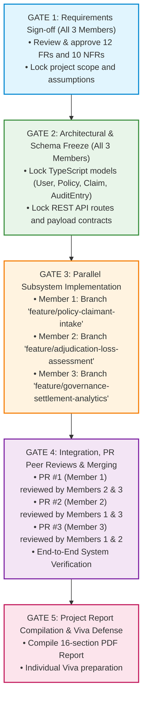

# RUET CSE 3206 — Software Engineering Sessional
# Team Work Distribution & Collaboration Protocol: Group 21

> **Project:** Insurance Claim System  
> **Course:** CSE 3206 – Software Engineering Sessional (Lab 2)  
> **Team:** Group 21 (`Group#01 from Section B (1st 30)`)  
> **Process Model:** **Waterfall Model**  
> **Repository:** `insurance-claim-system`  

---

## 1. Executive Summary & Strategy

This document establishes the **formal work distribution, architectural ownership, and GitHub collaboration protocol** for the 3 members of Group 21.

### The Waterfall Concurrency Challenge & Solution
In a classical Waterfall lifecycle, development is strictly sequential. In a university project with 3 teammates, members cannot sit idle while another writes code. 

To solve this while remaining 100% compliant with Waterfall principles:
1. **Upfront Contract Freeze (Waterfall Design Phase):** All 3 members collaborate upfront to define and freeze the data models, state machine, and REST API contract in `PROJECT_ARCHITECTURE_AND_WORKFLOW.md`.
2. **Full-Stack Subsystem Decomposition (Implementation Phase):** Once interfaces are frozen, the system is partitioned into **3 equal, decoupled, full-stack subsystems**. Each member develops both the backend endpoints and frontend views for their assigned subsystem on their own Git feature branch.
3. **Formal Verification & Integration (Testing Phase):** Feature branches are merged via structured Pull Requests with mandatory peer reviews, followed by joint end-to-end testing.
4. **Equal Academic Contribution:** All 3 members write comparable amounts of code, generate substantive Git commits, own designated sections of the 16-section **Project Design Report**, and master their domain for the individual viva.

---

## 2. The 5-Gate Waterfall Collaboration Framework



---

## 3. Subsystem Assignment Overview

| Metric | Member 1 | Member 2 | Member 3 |
| :--- | :--- | :--- | :--- |
| **Domain Title** | **Policy & Claimant Intake Subsystem** | **Claims Adjudication & Loss Subsystem** | **Governance, Settlement & Analytics** |
| **Primary Actor** | Policyholder (Claimant) | Claims Adjuster / Examiner | Administrator / Compliance Officer |
| **Git Branch** | `feature/policy-claimant-intake` | `feature/adjudication-loss-assessment` | `feature/governance-settlement-analytics` |
| **Backend Layer** | Express setup, Policy Catalog API, Claim Submission & Validation Engine | Adjudication Queue API, Loss Calculator, Approve/Reject Transition Rules | Immutable Audit Trail Engine, Settlement Disbursement, Executive Analytics |
| **Frontend Layer** | Policyholder Dashboard, Policy Card Grid, Multi-step Claim Submission Wizard | Adjuster Review Workspace, Claim Detail Inspector, Adjudication Decision Modals | Executive Analytics KPI Cards, Settlement Disbursement Table, Audit Timeline |
| **Report Sections** | Sections 1, 2, 3, 4, 5, 7 | Sections 6, 8, 9, 10, 11, 12 | Sections 13, 14, 15, 16 |
| **Code Proportion** | ~33% Full-Stack | ~33% Full-Stack | ~33% Full-Stack |

---

## 4. Member 1: Detailed Dossier
### Subsystem: Policy Management & Claimant Intake

#### 4.1 Subsystem Scope & Purpose
Member 1 owns the gateway through which users interact with their policies and through which claims legally enter the system. Without robust validation at intake, fraudulent, out-of-bounds, or corrupted claims will pollute the adjudication queue.

#### 4.2 Assigned Technical Components
- **Backend Responsibilities (`src/backend`):**
  - Initialize the core Express server structure and environment configuration.
  - Implement Policy Service & Controller (`GET /api/policies`, `GET /api/policies/:id`):
    - Supports Auto, Health, Home, and Life insurance policy types.
    - Tracks policy coverage limit, deductible amount, and expiration date.
  - Implement Claim Intake & Validation Service (`POST /api/claims`, `GET /api/claims/my-claims`):
    - Validates that the policy is active and belongs to the claimant.
    - Validates that `incidentDate` is not in the future.
    - Validates that `claimedAmount` is positive ($>0$) and does not exceed policy coverage limit.
    - Generates unique tracking ID (e.g., `CLM-2026-001`) and sets initial state to `SUBMITTED`.
  - Evidence attachment storage handler (simulates saving uploaded document URLs/receipts).
- **Frontend Responsibilities (`src/frontend`):**
  - **Policyholder Portal Shell**: Navigation header, role identifier, user profile summary.
  - **Policy Overview Screen**: Visual cards displaying active policies, deductible figures, and coverage caps.
  - **Multi-step Claim Submission Wizard**:
    - *Step 1:* Policy Selection (choose active policy).
    - *Step 2:* Incident Details (Date, Category, Location, Description).
    - *Step 3:* Financial Loss & Evidence (Claimed amount input, file attachment preview).
    - *Step 4:* Summary & Submission Confirmation.
  - **Claimant Tracking View**: List of personal claims with visual status badges (`Submitted`, `Under Review`, `Approved`, `Rejected`).
  - **Claim Edit / Withdrawal**: Ability to edit or cancel a claim *only* while in `SUBMITTED` state.

#### 4.3 Git Workflow & Sample Commits
- **Branch:** `feature/policy-claimant-intake`
- **Sample Commits:**
  - `feat(server): setup express typescript foundation and error middleware`
  - `feat(policy): implement policy catalog service and seed policies`
  - `feat(claim): create claim submission endpoint with boundary validations`
  - `feat(ui): build policyholder dashboard and active policy cards`
  - `feat(ui): implement multi-step claim filing wizard with evidence upload`
  - `test(claim): verify input validation for future incident dates and invalid amounts`

#### 4.4 Report Sections Owned
- **Section 1:** Cover Page
- **Section 2:** Team Information
- **Section 3:** Project Title & Metadata
- **Section 4:** Problem Statement (Traditional paper bottlenecks, filing delays, transparency gaps)
- **Section 5:** Project Objectives (Measurable digital filing targets, response SLAs)
- **Section 7:** Functional Requirements (Specification of FR-01 to FR-12)

#### 4.5 Viva Voce Preparation
- *Question 1:* "How does your subsystem prevent a policyholder from claiming more than their policy limit?"
  - *Answer:* "During intake validation in `claimService.ts`, the system queries the associated policy ID from the policy catalog. If `claimedAmount > policy.coverageLimit`, the API immediately rejects the request with HTTP 422 Unprocessable Entity and an explicit boundary violation message before the claim can be saved."
- *Question 2:* "Why is strict validation at the intake phase essential in the Waterfall model?"
  - *Answer:* "Waterfall relies on defect prevention early in the lifecycle. By eliminating invalid, malformed, or fraudulent data at the entry gate, downstream subsystems (adjudication and settlement) operate on verified inputs, preventing costly rollbacks."

---

## 5. Member 2: Detailed Dossier
### Subsystem: Claims Adjudication & Loss Assessment

#### 5.1 Subsystem Scope & Purpose
Member 2 owns the core business logic of insurance adjudication: the investigation, loss evaluation, deductible subtraction, and legal decision-making conducted by professional Claims Adjusters.

#### 5.2 Assigned Technical Components
- **Backend Responsibilities (`src/backend`):**
  - Implement Adjuster Work Queue Controller (`GET /api/adjuster/claims`):
    - Multi-criteria filtering by claim status (`SUBMITTED`, `UNDER_REVIEW`), policy type, and claimed amount range.
    - Sorting by urgency/submission date.
  - Implement Claim State Transition Engine:
    - `PATCH /api/claims/:id/assign` (assign adjuster, move to `UNDER_REVIEW`).
    - Enforces legal status progression (cannot move from `SUBMITTED` directly to `SETTLED`).
  - Implement Adjudication & Loss Calculation Engine (`POST /api/claims/:id/adjudicate`):
    - Calculates approved payout using standard insurance formula:
      $$\text{Approved Payout} = \min(\text{Assessed Loss}, \text{Coverage Limit}) - \text{Deductible}$$
    - Validates that approved amount is non-negative and $\le$ claimed amount.
    - Mandatory legal reason validation for rejected claims.
    - Emits event/trigger to Member 3's audit logger upon decision commit.
- **Frontend Responsibilities (`src/frontend`):**
  - **Adjuster Workspace Dashboard**: Clean, responsive claims queue with priority color badges.
  - **Claim Inspection Detail Drawer/Modal**:
    - Side-by-side view: Claimant statements vs. attached evidence (photos, bills).
    - Policy details panel (Coverage limit, deductible, prior claim history).
  - **Interactive Loss Assessment Calculator**:
    - Adjuster inputs assessed damage $\rightarrow$ calculator automatically computes deductible deduction and suggests allowable settlement amount.
  - **Decision Execution Modals**:
    - *Approve Modal:* Input approved payout, add adjuster notes, confirm settlement authorization.
    - *Reject Modal:* Select standard rejection category (Policy Exclusions, Insufficient Proof, Expired Policy) and write mandatory rationale.

#### 5.3 Git Workflow & Sample Commits
- **Branch:** `feature/adjudication-loss-assessment`
- **Sample Commits:**
  - `feat(adjuster): implement queue endpoint with status and category filtering`
  - `feat(engine): implement adjudication calculation engine with deductible rules`
  - `feat(state): enforce deterministic state machine transitions for claims`
  - `feat(ui): build adjuster workspace queue with priority badges`
  - `feat(ui): develop interactive loss calculation console and decision modals`
  - `fix(adjudicate): prevent claim approval when assessed loss is below deductible`

#### 5.4 Report Sections Owned
- **Section 6:** Stakeholder Analysis (Policyholders, Adjusters, Administrators, Regulatory Auditors)
- **Section 8:** Non-Functional Requirements (Specification of NFR-01 to NFR-10)
- **Section 9:** User Stories & Use Cases (5 comprehensive scenarios with acceptance criteria)
- **Section 10:** Selected Software Process Model (Waterfall declaration)
- **Section 11:** Justification of Process Model (Regulatory compliance, zero ambiguity, audit requirements)
- **Section 12:** Comparison with Alternative Models (Contrasting Waterfall vs. Agile Scrum and Prototyping)

#### 5.5 Viva Voce Preparation
- *Question 1:* "How does the system ensure an adjuster does not approve an arbitrary settlement amount?"
  - *Answer:* "The adjudication controller enforces domain logic where the approved amount is bounded by the assessed loss minus the policy deductible, never exceeding the policy coverage limit. If the assessed loss is less than the deductible, the system alerts the adjuster that no payout is legally due."
- *Question 2:* "Why is Agile Scrum less suited for this adjudication engine compared to Waterfall?"
  - *Answer:* "Agile encourages rapid pivots and flexible specifications. However, insurance claim adjudication is governed by statutory laws and insurance policy contracts. Shifting business logic sprint-to-sprint creates severe legal liabilities. Waterfall ensures these contractual settlement formulas are formally analyzed, verified, and locked before execution."

---

## 6. Member 3: Detailed Dossier
### Subsystem: Governance, Financial Settlement & Executive Analytics

#### 6.1 Subsystem Scope & Purpose
Member 3 owns compliance, corporate oversight, financial disbursement, and auditability. In insurance, a claim decision is meaningless without an immutable legal record, payout execution, and executive visibility over loss ratios and operational efficiency.

#### 6.2 Assigned Technical Components
- **Backend Responsibilities (`src/backend`):**
  - Implement Immutable Audit Trail Engine (`/api/audit`, `GET /api/claims/:id/audit-trail`):
    - Records an immutable log entry for every state transition:
      `{ logId, claimId, timestamp, actorId, actorRole, action, previousState, newState, remarks }`.
    - Tamper-evident architecture (logs are append-only; updates and deletes are strictly prohibited).
  - Implement Financial Settlement Disbursement Service (`POST /api/claims/:id/disburse`):
    - Transitions `APPROVED` claims to `SETTLED`.
    - Generates mock banking transaction reference ID (`TXN-XXXXXXXX`).
    - Produces a formal Settlement Statement payload (claimant info, policy info, payout amount, disbursement timestamp).
  - Implement Executive Analytics Aggregation Engine (`GET /api/analytics/overview`):
    - Computes real-time KPIs: Total Claims Filed, Settlement Ratio (Approved vs. Rejected), Total Capital Disbursed (\$), Average Adjudication Turnaround Time (in hours/days), and Claims per Category (Auto/Health/Home/Life).
- **Frontend Responsibilities (`src/frontend`):**
  - **Executive & Compliance Portal**:
    - KPI metric summary cards with clean visual trend indicators.
    - Graphical distribution breakdowns (Claim volume by category and status).
  - **Financial Settlement Disbursement Console**:
    - List of approved claims awaiting treasury disbursement.
    - One-click "Authorize Disbursement" with transaction receipt generation.
  - **Audit Trail Inspector Timeline**:
    - Interactive visual timeline component on claim detail views showing the complete life history of the claim from submission to settlement with timestamps and reviewer IDs.
  - **System Seed Data Reset Control**: Quick-reset button to reset demo data during live viva presentations.

#### 6.3 Git Workflow & Sample Commits
- **Branch:** `feature/governance-settlement-analytics`
- **Sample Commits:**
  - `feat(audit): implement append-only audit trail logging engine`
  - `feat(settlement): develop payout disbursement service and transaction receipts`
  - `feat(analytics): create executive KPI aggregation endpoints for loss ratios`
  - `feat(ui): build executive compliance dashboard with metrics cards and charts`
  - `feat(ui): implement visual audit trail timeline inspector`
  - `feat(ui): create financial settlement disbursement table`

#### 6.4 Report Sections Owned
- **Section 13:** MVP Design Overview (Architecture diagrams, layered component models, schema)
- **Section 14:** GitHub Collaboration Evidence (Screenshots of commit history, 3 branches, PRs, peer reviews)
- **Section 15:** Challenges Encountered (State synchronization, boundary validations, Git merge handling)
- **Section 16:** Conclusion (Milestone summary, reflection, and preparation for future labs on Design Patterns)

#### 6.5 Viva Voce Preparation
- *Question 1:* "How does your subsystem satisfy the regulatory audit requirements of an insurance company?"
  - *Answer:* "The audit engine implements an append-only transaction ledger. Every state modification—from initial submission to adjuster notes and treasury disbursement—creates an immutable log entry with an ISO timestamp, actor ID, and state delta. Logs cannot be modified or deleted via any API endpoint, providing a verifiable paper trail for insurance regulators."
- *Question 2:* "How does this MVP structure support upcoming lab milestones like Design Patterns?"
  - *Answer:* "The architecture cleanly separates domain services. In Lab 3/4, we can easily apply the *State Pattern* to the claim lifecycle transitions, the *Strategy Pattern* to different policy loss calculation algorithms, and the *Observer Pattern* to notify the audit engine and claimants whenever status changes."

---

## 7. GitHub Peer-Review & Merging Protocol

Lab 2 explicitly allocates **2 Marks** for GitHub collaboration. The following review protocol must be followed:

### 7.1 Pull Request Review Matrix

| PR # | Author | Feature Description | Mandatory Reviewers | Merge Target |
| :---: | :--- | :--- | :--- | :---: |
| **PR #1** | **Member 1** | `feature/policy-claimant-intake` | **Member 2 & Member 3** | `main` |
| **PR #2** | **Member 2** | `feature/adjudication-loss-assessment` | **Member 1 & Member 3** | `main` |
| **PR #3** | **Member 3** | `feature/governance-settlement-analytics` | **Member 1 & Member 2** | `main` |

### 7.2 Pull Request Checklist (Required on Every PR)
Before requesting review, ensure your PR description includes:
```markdown
## Feature Description
Summary of the subsystem components implemented.

## Subsystem Belonging
- [ ] Member 1: Policy & Intake
- [ ] Member 2: Adjudication & Loss
- [ ] Member 3: Governance & Analytics

## Verification & Testing Performed
- [ ] TypeScript types compile without errors (`npm run build`)
- [ ] All new endpoints verified with valid and invalid payloads
- [ ] UI tested across standard viewport sizes

## Evidence
[Attach screenshot or terminal output showing working component]
```

### 7.3 Peer Review Comment Standards
Reviewers must leave at least one constructive review comment before clicking "Approve". Examples:
- *Good Review:* "Validated the input boundary check in `claimService.ts`. Verified that entering a future date returns 400 Bad Request as specified in FR-03. LGTM!"
- *Good Review:* "Checked the deductible calculation in `adjudicationService.ts`. The formula properly clamps to 0 if deductible exceeds assessed damage. Approved."

---

## 8. Report Assembly & Deliverable Checklist

| Task | Owner | Status | Output File |
| :--- | :---: | :---: | :--- |
| **Complete System Specification** | All 3 | Completed | `PROJECT_SPECIFICATION.md` |
| **Work Distribution & Protocol** | All 3 | Completed | `TEAM_WORK_DISTRIBUTION.md` |
| **System Architecture & Workflow** | All 3 | Completed | `PROJECT_ARCHITECTURE_AND_WORKFLOW.md` |
| **Report Sections 1–5, 7** | Member 1 | In Progress | Markdown draft $\rightarrow$ PDF |
| **Report Sections 6, 8–12** | Member 2 | In Progress | Markdown draft $\rightarrow$ PDF |
| **Report Sections 13–16** | Member 3 | In Progress | Markdown draft $\rightarrow$ PDF |
| **Final PDF Compilation** | All 3 | Pending | `docs/Requirement_Report.pdf` |
| **Screenshots Collection** | All 3 | Pending | `screenshots/*.png` |
